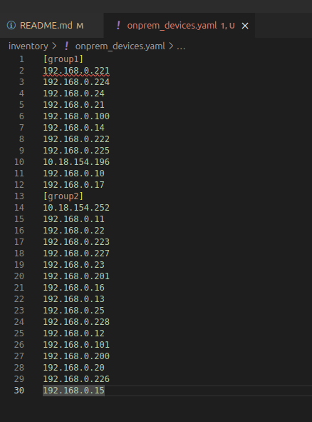

# Custom README

## Before you start
  - Update inventory/group_vars/CVP.yml variables with CVP and EOS variables for your infrastructure
  - update terminattr.cfg file with correct configuration.  This file will be uploaded as a configlet on CVaaS and assigned to all devices

## step1
run playbook with 'facts' tag

## step2
review cv_facts/cvp_containers.yaml
  - if you have images assigned to containers, make sure CVaaS has an existing bundle with the same name
review cv_facts/cvp_devices.yml (might have to clean up extra configlets)
  - if you have images assigned to devices, make sure CVaaS has an existing bundle with the same name

## step3
split the inventory/onprem_devices.yaml inventory manually
  - split with headers [group1], [group2]...
  - delete [onprem_devices]
  example:
  

## step4
modify the inventory/group_vars/CVP.yml file deployement variables to point at the group you want (ex: group1) defined in step3
run playbook with 'deploy' tag 
notes: 
  - make sure you point to the inventory folder, not idividual inventory file

## step6
validate the generated tasks on CVaaS and execute.
